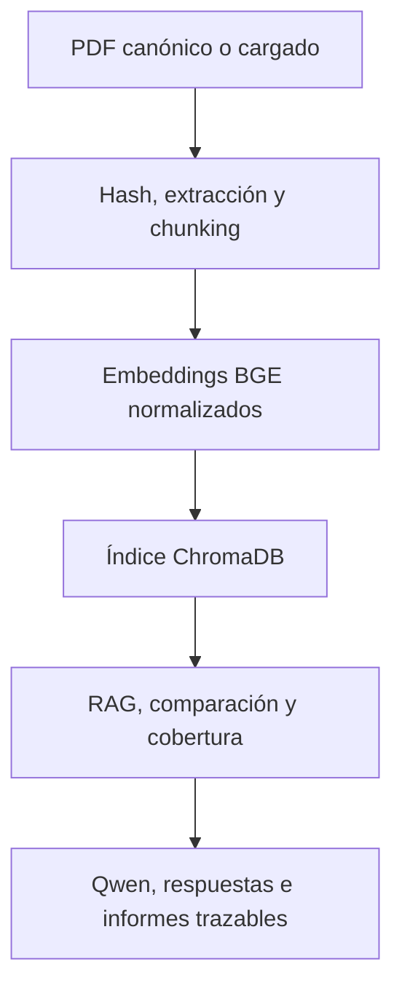

# Sistema inteligente de análisis documental con RAG

Sistema local para cargar, consultar, comparar y preevaluar documentos PDF mediante embeddings semánticos, una base de datos vectorial y un modelo de lenguaje.

El proyecto combina **BGE**, **ChromaDB**, **Qwen**, **SQLite** y **Streamlit** para generar resultados trazables hasta el archivo, la página y el fragmento utilizados.

> La cobertura calculada por el sistema es semántica y documental. No certifica cumplimiento legal o normativo ni sustituye una auditoría realizada por una persona competente.

## Alcance

El Trabajo Fin de Máster se centra exclusivamente en el análisis documental. El sistema permite:

- auditar un corpus de PDF y detectar duplicados binarios o textuales;
- construir un corpus canónico sin documentos repetidos;
- extraer texto por página y dividirlo en fragmentos solapados;
- generar embeddings normalizados con BGE;
- indexar y recuperar evidencias mediante ChromaDB;
- responder preguntas con un LLM local y etiquetas de fuente;
- restringir cada consulta a uno o varios documentos seleccionados;
- comparar semánticamente exactamente dos documentos;
- preevaluar la cobertura frente a un documento de referencia;
- incorporar nuevos PDF con control de duplicados y registro persistente;
- exportar informes de comparación y cobertura en Markdown;
- utilizar las funciones principales desde una interfaz Streamlit.

## Estado actual

| Componente | Estado |
|---|---|
| Auditoría y deduplicación del corpus | Completado |
| Índice canónico con BGE y ChromaDB | Completado |
| RAG con etiquetas de fuente y aislamiento documental | Completado |
| Comparación semántica de dos documentos | Completado |
| Preevaluación de cobertura documental | Completado |
| Ingesta dinámica de PDF | Completado |
| Registro persistente en SQLite | Completado |
| Interfaz Streamlit | Completado |
| Evaluación del retrieval | Completado |
| Evaluación de respuestas RAG | Completado |
| Detección de documentos que requieren OCR | Completado |
| Ejecución automática de OCR | No implementado |

## Corpus documental

El corpus de trabajo contiene **173 archivos PDF**:

- 162 documentos procedentes del conjunto de OSHA utilizado durante el desarrollo;
- 11 publicaciones adicionales de NIOSH y OSHA empleadas para ampliar y evaluar el sistema.

La auditoría produjo los siguientes resultados:

| Métrica | Resultado |
|---|---:|
| PDF analizados | 173 |
| Duplicados binarios detectados | 93 |
| Problemas de extracción o posibles escaneados | 4 |
| Documentos canónicos utilizables | 78 |
| Fragmentos indexados con BGE | 8.828 |

Los principales artefactos de auditoría son:

- `reports/corpus_audit.csv`: inventario completo;
- `reports/canonical_documents.csv`: manifiesto de documentos canónicos;
- `reports/extraction_problems.csv`: documentos sin texto útil o con posible necesidad de OCR.

Los PDF originales y la base vectorial no se versionan en Git. Antes de redistribuir documentos obtenidos de fuentes externas se deben revisar sus condiciones de uso y conservar su atribución.

## Arquitectura



### Flujo del corpus canónico

1. `scripts/audit_corpus.py` calcula hashes, extrae texto y genera el manifiesto canónico.
2. Los PDF válidos se procesan página por página.
3. El texto se divide en fragmentos de aproximadamente 300 palabras con un solapamiento de 50.
4. `BAAI/bge-base-en-v1.5` genera embeddings normalizados de 768 dimensiones.
5. Los fragmentos y sus metadatos se almacenan en la colección `documents_bge_base_v1_5` de ChromaDB.
6. Las consultas utilizan la instrucción de búsqueda de BGE y recuperan evidencias con archivo, página, chunk, distancia y similitud.
7. `Qwen/Qwen2.5-3B-Instruct` genera respuestas condicionadas por las evidencias recuperadas.

### Flujo de ingesta dinámica

1. Se valida que el archivo sea un PDF legible.
2. Se calcula su SHA-256 binario.
3. Se extrae y normaliza el texto para calcular un segundo SHA-256.
4. Se comprueban duplicados en el manifiesto canónico y en el registro dinámico.
5. Si no existe un duplicado, el archivo se copia a `data/uploads/`.
6. Sus fragmentos se indexan en ChromaDB y el documento se registra en `data/registry/documents.db`.
7. Si no contiene texto útil, se registra con estado `needs_ocr` y no se generan embeddings vacíos.

La ingesta aplica rollback si falla una operación posterior al copiado o a la indexación.

## Tecnologías

- Python 3.13.12 en el entorno de desarrollo;
- `pypdf` para extracción de texto y metadatos de PDF;
- `sentence-transformers` y `BAAI/bge-base-en-v1.5` para embeddings;
- ChromaDB como base de datos vectorial persistente;
- `transformers` y `Qwen/Qwen2.5-3B-Instruct` como LLM local;
- NumPy para operaciones de similitud coseno;
- SQLite para el registro de documentos incorporados dinámicamente;
- Streamlit para la interfaz de usuario;
- pandas y scikit-learn como apoyo al análisis y la evaluación.

### Entorno de evaluación

Las evaluaciones finales se ejecutaron localmente con:

- sistema operativo: Microsoft Windows 11 Home, versión 10.0.26200;
- Python 3.13.12;
- procesamiento: CPU, sin CUDA;
- memoria RAM: aproximadamente 32 GB;
- modelo de embeddings: `BAAI/bge-base-en-v1.5`;
- modelo generativo: `Qwen/Qwen2.5-3B-Instruct`.

Los tiempos pueden variar según el procesador, la memoria disponible y el estado de carga del sistema.

## Estructura principal

```text
TFM_Documental_AI/
├── app.py
├── ask.py
├── compare.py
├── check_coverage.py
├── ingest.py
├── requirements.txt
├── README.md
├── scripts/
│   ├── audit_corpus.py
│   └── index_corpus_bge.py
│
├── src/
│   ├── analysis/
│   │   ├── analyzer.py
│   │   ├── document_comparator.py
│   │   └── requirements_coverage.py
│   ├── embeddings/
│   │   └── text_model.py
│   ├── ingestion/
│   │   └── document_service.py
│   ├── llm/
│   │   └── llm.py
│   ├── loaders/
│   │   ├── __init__.py
│   │   ├── chunker.py
│   │   └── pdf_loader.py
│   ├── registry/
│   │   └── document_registry.py
│   ├── retrieval/
│   │   └── rag.py
│   └── vector_db/
│       └── chroma_db.py
│
├── tests/
│   ├── evaluation_questions.py
│   ├── evaluate_retrieval.py
│   ├── evaluate_rag_grounding.py
│   └── smoke_test_dynamic_ingestion.py
│
├── reports/
│   ├── evaluation/              # CSV y resúmenes de evaluación
│   ├── comparisons/             # Informes de comparación
│   ├── coverage/                # Informes de cobertura
│   └── canonical_documents.csv  # Manifiesto canónico
│
├── docs/                        # Documentación técnica y fuentes
│
├── evidencias/                   # Evidencias de fuentes y derechos de uso
│
└── data/                         # Datos locales no versionados
    ├── documents/                # Corpus PDF
    ├── chroma/                   # Base vectorial
    ├── registry/                 # Base SQLite
    └── uploads/                  # PDF incorporados dinámicamente
```

Los directorios `data/chroma/`, `data/documents/`, `data/registry/` y `data/uploads/` son persistentes en la ejecución local, pero se excluyen del repositorio.

## Instalación

### 1. Clonar el repositorio

```powershell
git clone https://github.com/Alejandra-Romero-G/TFM_Documental_AI.git
cd TFM_Documental_AI
```

### 2. Crear y activar un entorno virtual

```powershell
python -m venv env
env\Scripts\Activate.ps1
```

### 3. Instalar las dependencias

```powershell
python -m pip install --upgrade pip
python -m pip install -r requirements.txt
```

La primera ejecución descarga los modelos desde Hugging Face. El sistema puede funcionar sin autenticación, aunque es recomendable configurar un token para evitar límites de descarga:

```powershell
$env:HF_TOKEN = "TU_TOKEN_DE_HUGGING_FACE"
```

## Preparación e indexación del corpus

### 1. Colocar los documentos

Los PDF del corpus se almacenan bajo `data/documents/`.

### 2. Auditar el corpus

```powershell
python .\scripts\audit_corpus.py
```

Este proceso genera el inventario, detecta duplicados y crea el manifiesto canónico.

### 3. Validar la indexación sin escribir

```powershell
python .\scripts\index_corpus_bge.py --dry-run
```

### 4. Construir o reanudar el índice

```powershell
python .\scripts\index_corpus_bge.py
```

La indexación utiliza `upsert` e identifica los chunks existentes, por lo que puede reanudarse después de una interrupción.

## Uso

### Interfaz Streamlit

```powershell
python -m streamlit run .\app.py
```

La interfaz incluye:

- **Inicio**: estado del corpus y funciones disponibles;
- **Cargar PDF**: ingesta con detección de duplicados;
- **Preguntar**: consultas globales o sobre documentos seleccionados;
- **Comparar**: comparación semántica de dos documentos;
- **Cobertura**: preevaluación frente a un documento de referencia;
- **Registro**: consulta de documentos incorporados dinámicamente.

### Ingestar un PDF desde la terminal

Validación sin modificar SQLite ni ChromaDB:

```powershell
python .\ingest.py .\ruta\documento.pdf --document-type report --analysis-role target --source-name "Organización" --dry-run
```

Para la ingesta definitiva, elimine `--dry-run`.

### Realizar una pregunta

Consulta global:

```powershell
python .\ask.py "What should employers do to protect workers from heat stress?"
```

Consulta restringida a un documento:

```powershell
python .\ask.py --document 2016-106.pdf "What training and preventive measures should employers provide?"
```

La respuesta incluye etiquetas como `[S1]` y una lista determinista con el archivo, la página y el chunk de cada fuente.

### Comparar dos documentos

```powershell
python .\compare.py 2010-114.pdf 2016-106.pdf --focus "heat stress hazards, symptoms, first aid and preventive measures" --chunks-per-document 4 --threshold 0.65 --output .\reports\comparisons\2010-114_vs_2016-106.md
```

La comparación calcula similitud global, pares de evidencias relacionadas y evidencias diferenciales. El resultado está limitado a los fragmentos recuperados y no implica equivalencia factual.

### Preevaluar cobertura documental

```powershell
python .\check_coverage.py 2016-106.pdf 2010-114.pdf --focus "heat stress hazards, first aid, preventive measures and employer responsibilities" --n-results 4 --match-threshold 0.65 --review-threshold 0.55 --output .\reports\coverage\2010-114_against_2016-106.md
```

El primer documento es la referencia y el segundo es el documento evaluado. Los estados posibles son coincidencia semántica, revisión manual y sin evidencia recuperada.

## Evaluación

El proyecto contiene dos evaluaciones reproducibles: una del ranking documental y otra de las respuestas generadas por el sistema RAG.

### Evaluación del retrieval

```powershell
python .\tests\evaluate_retrieval.py
```

Se utilizaron 11 consultas curadas manualmente sobre 11 publicaciones de NIOSH y OSHA. La recuperación se ejecutó con la función RAG de producción y un máximo de un chunk por PDF para medir el ranking a nivel de documento.

| Métrica | Resultado |
|---|---:|
| Hit@1 | 90,91 % |
| Hit@3 | 100,00 % |
| Hit@5 | 100,00 % |
| MRR@5 | 0,9545 |
| Precision@5 media | 0,2364 |
| Precision@5 máxima alcanzable | 0,2364 |
| Precision@5 normalizada | 1,0000 |
| Recall@5 medio | 1,0000 |
| Latencia media de retrieval | 0,0927 s |

La precisión bruta es baja porque la mayoría de las consultas solo tienen un documento marcado como relevante dentro de cinco posiciones. La precisión normalizada indica que se recuperó el máximo número posible de documentos relevantes bajo esa definición.

Artefactos:

- `reports/evaluation/retrieval_bge_console.txt`;
- `reports/evaluation/retrieval_bge_results.csv`;
- `reports/evaluation/retrieval_bge_summary.md`.

### Evaluación de respuestas RAG

```powershell
python .\tests\evaluate_rag_grounding.py
```

La evaluación incluye cinco preguntas factuales y una pregunta fuera del dominio para comprobar la abstención. Cada caso está restringido a un documento concreto.

| Métrica | Resultado |
|---|---:|
| Respuestas no vacías | 100,00 % |
| Aislamiento documental | 100,00 % |
| Presencia de etiquetas de fuente | 100,00 % |
| Validez de etiquetas de fuente | 100,00 % |
| Cobertura conceptual media | 95,00 % |
| Abstención correcta | 100,00 % |
| Casos que superaron los criterios automáticos | 100,00 % |
| Latencia media por caso | 113,92 s |

La cobertura conceptual es una comprobación léxica basada en grupos de términos esperados. La validez de las etiquetas comprueba su presencia y correspondencia con las fuentes recuperadas, pero no verifica automáticamente que cada afirmación esté completamente respaldada. Por ello, los resultados requieren una revisión factual humana.

La latencia refleja la ejecución local en CPU del retrieval y la generación, sin contar la carga inicial de los modelos.

Los resultados existentes pueden reevaluarse sin volver a ejecutar el LLM:

```powershell
python .\tests\evaluate_rag_grounding.py --reuse-results .\reports\evaluation\rag_grounding_results.csv
```

Artefactos:

- `reports/evaluation/rag_grounding_console.txt`;
- `reports/evaluation/rag_grounding_results.csv`;
- `reports/evaluation/rag_grounding_summary.md`.

### Prueba de ingesta dinámica

```powershell
python .\tests\smoke_test_dynamic_ingestion.py
```

La prueba crea un PDF temporal, lo ingesta, verifica el registro SQLite, recupera exclusivamente sus evidencias desde ChromaDB y elimina los datos de prueba al finalizar.

## Trazabilidad y controles

- Cada chunk conserva un ID estable, el ID canónico, el archivo, la página y el índice del fragmento.
- Las búsquedas pueden filtrarse por uno o varios IDs documentales.
- Las funciones de comparación y cobertura verifican que las fuentes pertenezcan a los documentos seleccionados.
- Los informes separan el texto generado por el LLM de las fuentes recuperadas de forma determinista.
- Los duplicados se comprueban tanto por hash binario como por hash textual normalizado.
- El sistema no introduce documentos sin texto en el índice vectorial.
- Los archivos `.pyc`, las carpetas `__pycache__`, las bases SQLite, los PDF y el índice Chroma se excluyen de Git.

## Limitaciones

- El corpus de evaluación es reducido y está centrado en publicaciones ocupacionales en inglés.
- La calidad de las respuestas depende de los fragmentos recuperados y del modelo generativo local.
- Una similitud alta indica proximidad semántica, no equivalencia factual.
- Una cobertura alta no demuestra cumplimiento legal; una cobertura baja tampoco demuestra incumplimiento.
- Los informes deben revisarse junto con sus fuentes por una persona competente.
- Los PDF escaneados se detectan, pero el motor OCR todavía no está integrado.
- La generación con Qwen en CPU es considerablemente más lenta que el retrieval.
- Las métricas automáticas complementan, pero no sustituyen, una evaluación humana más amplia.

## Reproducibilidad

Para reproducir los resultados principales:

1. utilizar el mismo manifiesto canónico;
2. mantener `BAAI/bge-base-en-v1.5` y la instrucción de consulta de producción;
3. utilizar embeddings normalizados y distancia coseno;
4. conservar el chunking de 300 palabras y 50 palabras de solapamiento;
5. ejecutar las consultas incluidas en `tests/`;
6. registrar las versiones de las dependencias y el hardware empleado;
7. conservar los CSV e informes de `reports/evaluation/`.

### Obtención del corpus

Los PDF originales no se distribuyen en el repositorio. Las fuentes, metadatos y evidencias de derechos de uso se documentan en `docs/Fuente.md` y `evidencias/02_licencias/`.

Para reproducir exactamente la auditoría deben utilizarse los mismos 173 PDF. Sus nombres, tamaños y hashes SHA-256 están registrados en `reports/corpus_audit.csv`.

## Conclusión

El prototipo implementa de extremo a extremo la auditoría, indexación, recuperación, generación condicionada por las evidencias recuperadas, comparación, cobertura, ingesta dinámica y visualización de documentos. Los resultados muestran un ranking documental sólido y respuestas con aislamiento y trazabilidad de fuentes, manteniendo explícitamente la distinción entre análisis semántico y evaluación legal o normativa.
