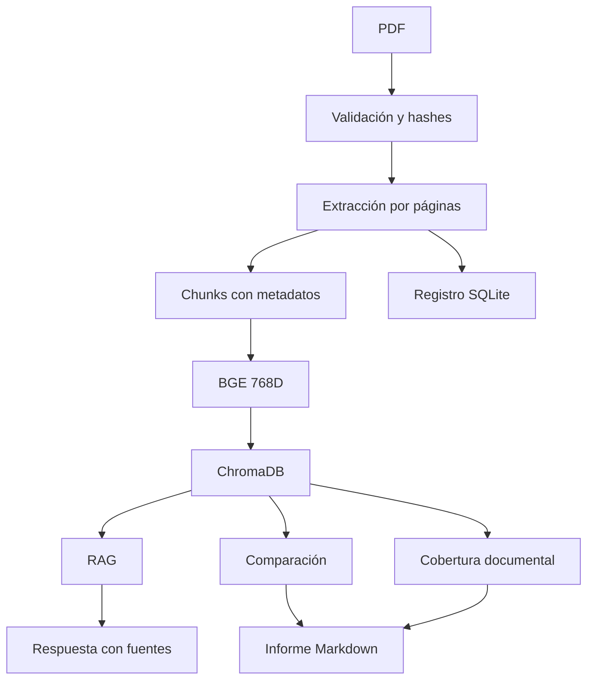

# Plan de desarrollo y estado final del TFM

**Fecha de actualización:** 2 de septiembre de 2026
**Repositorio:** `TFM_Documental_AI`
**Modalidad académica:** opción 3 de la guía del TFM, proyecto técnico de solución software aplicada a la analítica avanzada

## 1. Título definitivo

**Sistema inteligente para el análisis, comparación y evaluación de cobertura documental mediante RAG y bases vectoriales**

## 2. Objetivo

Desarrollar y evaluar una solución software local capaz de procesar documentos PDF, auditar y deduplicar un corpus, transformar el texto en representaciones vectoriales, recuperar evidencias mediante búsqueda semántica y generar respuestas trazables con un modelo de lenguaje.

La solución también permite incorporar nuevos PDF, comparar exactamente dos documentos y realizar una preevaluación semántica de cobertura frente a un documento de referencia. Los resultados muestran el archivo, la página y el fragmento utilizados como fuente.

## 3. Alcance definitivo

### Funcionalidades incluidas

- Procesamiento de PDF con texto extraíble.
- Extracción del texto página por página.
- Fragmentación con conservación de la procedencia.
- Auditoría del corpus y detección de duplicados.
- Generación de embeddings normalizados con BGE.
- Almacenamiento persistente en ChromaDB.
- Preguntas globales o restringidas a documentos seleccionados.
- Generación RAG mediante un LLM local.
- Etiquetas de fuente con archivo, página y chunk.
- Comparación semántica de exactamente dos documentos.
- Preevaluación semántica de cobertura documental.
- Ingesta dinámica con control de duplicados.
- Registro persistente de documentos en SQLite.
- Interfaz local desarrollada con Streamlit.
- Exportación de informes de comparación y cobertura en Markdown.
- Evaluación reproducible del retrieval y de las respuestas RAG.

### Exclusiones y trabajo futuro

- Ejecución automática de OCR sobre documentos escaneados.
- Comprensión visual de fotografías, diagramas o tablas complejas.
- Procesamiento de DOCX y TXT en la aplicación final.
- Análisis independiente de imágenes o vídeos.
- Comparación simultánea de más de dos documentos.
- Identificación automática de toda la normativa aplicable.
- Certificación legal o automática del cumplimiento normativo.
- Fine-tuning de modelos.
- LangGraph, sistemas multiagente o agentes autónomos.
- Docker, despliegue en la nube, autenticación y gestión multiusuario.

## 4. Advertencia sobre la cobertura documental

La función implementada se presenta como **preevaluación semántica de cobertura documental**. Una coincidencia semántica indica proximidad entre fragmentos, pero no demuestra que una entidad cumpla una obligación legal o que una medida se ejecute en la práctica.

> Este análisis comprueba la presencia de evidencia documental frente a referencias seleccionadas. No verifica la ejecución real de las medidas ni constituye asesoría, auditoría o certificación legal.

## 5. Arquitectura final

### Componentes principales

| Componente | Tecnología | Función |
|---|---|---|
| Extracción | `pypdf` | Lectura del PDF y conservación de la página |
| Fragmentación | Código propio | Chunks de 300 palabras con 50 de solapamiento |
| Embeddings | `BAAI/bge-base-en-v1.5` | Representación vectorial de documentos y consultas |
| Base vectorial | ChromaDB | Persistencia y recuperación semántica |
| Generación | `Qwen/Qwen2.5-3B-Instruct` | Respuestas y síntesis condicionadas por las evidencias |
| Registro | SQLite | Catálogo de documentos incorporados dinámicamente |
| Interfaz | Streamlit | Carga, consulta, comparación, cobertura y registro |
| Informes | Markdown | Exportación de resultados trazables |

El modelo inicial `all-MiniLM-L6-v2` se utilizó durante la fase exploratoria y fue sustituido por BGE. MiniLM no forma parte de la arquitectura ni de las métricas finales.

## 6. Corpus documental definitivo

El corpus local está formado por:

- 162 PDF procedentes de la recopilación *All OSHA PDF* de Kaggle;
- 11 publicaciones oficiales adicionales: 9 de NIOSH y 2 de OSHA;
- 173 PDF analizados en total.

### Resultado de la auditoría

| Métrica | Resultado |
|---|---:|
| PDF analizados | 173 |
| Duplicados binarios exactos | 93 |
| Duplicados adicionales por texto normalizado | 0 |
| Registros con problemas de extracción | 4 |
| Documentos canónicos con texto utilizable | 78 |
| Chunks presentes en la colección utilizada en la evaluación final | 8.828 |

Los cuatro problemas de extracción corresponden a dos documentos únicos sin texto extraíble y a sus respectivas copias exactas. Los duplicados se conservan en el corpus original, pero no se incluyen como documentos independientes en el índice canónico.

Los principales resultados de auditoría se almacenan en:

- `reports/corpus_audit.csv`;
- `reports/canonical_documents.csv`;
- `reports/exact_duplicates.csv`;
- `reports/content_duplicates.csv`;
- `reports/extraction_problems.csv`.

## 7. Estado de ejecución por fases

### Fase 1 - Base documental: completada

- [x] Configuración del repositorio y del entorno virtual.
- [x] Lectura de PDF página por página.
- [x] Limpieza y fragmentación del texto.
- [x] Conservación del archivo, la página y el índice de chunk.
- [x] Generación de embeddings BGE normalizados de 768 dimensiones.
- [x] Instrucción BGE específica para las consultas.
- [x] Almacenamiento persistente en la colección `documents_bge_base_v1_5`.
- [x] Recuperación semántica con distancia coseno.
- [x] Generación RAG mediante un modelo local.
- [x] Presentación determinista de las fuentes recuperadas.

### Fase 2 - Preparación y control del corpus: completada

- [x] Incorporación y organización de los 173 PDF.
- [x] Documentación de las fuentes y de las evidencias de derechos de uso.
- [x] Cálculo de SHA-256 binario y del texto normalizado.
- [x] Identificación de 93 duplicados exactos.
- [x] Detección de documentos sin texto útil.
- [x] Construcción del manifiesto de 78 documentos canónicos.
- [x] Exclusión de duplicados y documentos sin texto de la indexación final.

### Fase 3 - Evaluación del retrieval: completada

- [x] Creación de 11 consultas curadas manualmente.
- [x] Definición de los documentos relevantes esperados.
- [x] Evaluación mediante la función de recuperación utilizada en producción.
- [x] Cálculo de Hit@1, Hit@3, Hit@5, MRR@5, Precision@5, Recall@5 y latencia.
- [x] Exportación de resultados detallados a CSV.
- [x] Generación de un resumen metodológico en Markdown.

Resultados finales:

| Métrica | Resultado |
|---|---:|
| Hit@1 | 90,91 % |
| Hit@3 | 100,00 % |
| Hit@5 | 100,00 % |
| MRR@5 | 0,9545 |
| Precision@5 media | 0,2364 |
| Recall@5 media | 1,0000 |
| Latencia media del retrieval | 0,0927 s |

La Precision@5 bruta está limitada por el reducido número de documentos etiquetados como relevantes para cada consulta. La métrica normalizada utilizada en el experimento es complementaria y no sustituye a Hit@k, MRR y Recall@5.

### Fase 4 - Evaluación del RAG: completada con alcance controlado

- [x] Prompt restringido a las evidencias recuperadas.
- [x] Respuesta explícita cuando la información es insuficiente.
- [x] Consultas filtradas por documento.
- [x] Validación del aislamiento documental.
- [x] Comprobación de presencia y rango de las etiquetas de fuente.
- [x] Evaluación léxica de conceptos esperados.
- [x] Inclusión de un caso fuera del dominio para evaluar la abstención.
- [x] Medición del tiempo total de retrieval y generación.

La evaluación contiene cinco preguntas factuales y una pregunta fuera del dominio:

| Métrica | Resultado |
|---|---:|
| Respuestas no vacías | 100,00 % |
| Aislamiento documental | 100,00 % |
| Presencia de etiquetas de fuente | 100,00 % |
| Validez sintáctica de las etiquetas | 100,00 % |
| Cobertura conceptual léxica media | 95,00 % |
| Abstención correcta | 100,00 % |
| Casos que superaron los criterios automáticos | 100,00 % |
| Latencia media por caso | 113,92 s |

La cobertura conceptual es una aproximación léxica basada en términos esperados. La validez de las etiquetas comprueba su presencia y correspondencia con las fuentes recuperadas, pero no demuestra automáticamente que cada afirmación esté respaldada. Las respuestas requieren revisión factual humana.

### Fase 5 - Comparación y cobertura documental: implementada

- [x] Selección de exactamente dos documentos.
- [x] Recuperación separada de evidencias de cada documento.
- [x] Cálculo de similitud semántica global.
- [x] Identificación de pares de fragmentos relacionados.
- [x] Presentación de evidencias compartidas y diferenciales.
- [x] Exportación del informe de comparación en Markdown.
- [x] Selección de un documento de referencia y otro evaluado.
- [x] Clasificación de coincidencia semántica, revisión manual o ausencia de evidencia.
- [x] Exportación del informe de cobertura con advertencia obligatoria.

Estos módulos constituyen herramientas de apoyo documental. Sus resultados no deben interpretarse como equivalencia factual ni como certificación de cumplimiento.

### Fase 6 - Aplicación e ingesta dinámica: completada

- [x] Interfaz Streamlit.
- [x] Carga de nuevos PDF.
- [x] Detección de duplicados binarios y textuales.
- [x] Registro persistente en SQLite.
- [x] Indexación de nuevos chunks en ChromaDB.
- [x] Consultas globales y filtradas.
- [x] Vistas de comparación y cobertura.
- [x] Consulta del registro documental.
- [x] Rollback ante fallos de copiado, indexación o registro.
- [x] Prueba dinámica de extremo a extremo con limpieza posterior.

### Fase 7 - Documentación y entrega: en revisión final

- [x] README con instalación, arquitectura, uso y evaluaciones.
- [x] Código publicado en un repositorio accesible.
- [x] Dependencias registradas en `requirements.txt`.
- [x] Informes de evaluación conservados en `reports/evaluation/`.
- [x] Fuentes y derechos documentados.
- [x] Eliminar o archivar el código preliminar que ya no forma parte del flujo final.
- [ ] Unificar en todos los documentos la cifra definitiva de chunks.
- [ ] Regenerar o retirar los ejemplos de comparación y cobertura que contengan salidas anómalas.
- [ ] Verificar la instalación y el flujo principal después de la limpieza del repositorio.
- [ ] Actualizar la memoria técnica con las últimas correcciones.
- [ ] Actualizar referencias, índice y numeración de la memoria.
- [ ] Preparar y revisar el vídeo MP4 de un máximo de cinco minutos.
- [ ] Verificar que los tutores puedan acceder al repositorio y a los entregables.

## 8. Artefactos de evaluación que deben conservarse

### Retrieval

- `tests/evaluation_questions.py`;
- `tests/evaluate_retrieval.py`;
- `reports/evaluation/retrieval_bge_results.csv`;
- `reports/evaluation/retrieval_bge_summary.md`;
- `reports/evaluation/retrieval_bge_console.txt`.

### RAG

- `tests/evaluate_rag_grounding.py`;
- `reports/evaluation/rag_grounding_results.csv`;
- `reports/evaluation/rag_grounding_summary.md`;
- `reports/evaluation/rag_grounding_console.txt`.

### Ingesta dinámica

- `tests/smoke_test_dynamic_ingestion.py`.

Las pruebas exploratorias de MiniLM y los scripts manuales iniciales pueden eliminarse de la rama final o trasladarse a un directorio histórico claramente identificado. El historial de Git conserva esas versiones.

## 9. Entorno de ejecución y reproducibilidad

El desarrollo y las evaluaciones se realizaron en un entorno local con:

- Windows de 64 bits;
- Python 3.13.12;
- ejecución en CPU, sin CUDA;
- aproximadamente 32 GB de memoria RAM;
- dependencias fijadas en `requirements.txt`.

Para reproducir los resultados principales se debe:

1. obtener los mismos 173 PDF y colocarlos bajo `data/documents/`;
2. ejecutar `scripts/audit_corpus.py`;
3. comprobar el manifiesto `reports/canonical_documents.csv`;
4. construir el índice con `scripts/index_corpus_bge.py`;
5. ejecutar `tests/evaluate_retrieval.py`;
6. ejecutar `tests/evaluate_rag_grounding.py`;
7. conservar los CSV y resúmenes generados.

Los PDF originales, el índice ChromaDB y la base SQLite no se distribuyen en Git porque son datos o artefactos locales. El código, los metadatos, los hashes y los procedimientos permiten reconstruirlos.

## 10. Criterio de finalización

El proyecto se considerará listo para entregar cuando:

- otra persona pueda instalarlo siguiendo el README;
- el corpus canónico y el índice puedan reconstruirse;
- las funciones de carga, consulta, comparación y cobertura puedan ejecutarse;
- las métricas principales puedan reproducirse;
- el repositorio no contenga scripts preliminares que puedan confundirse con el flujo final;
- la memoria, el vídeo y los enlaces de entrega hayan sido revisados.

La prioridad final no es ampliar el alcance, sino asegurar la coherencia, trazabilidad, reproducibilidad y claridad de la solución ya implementada.
